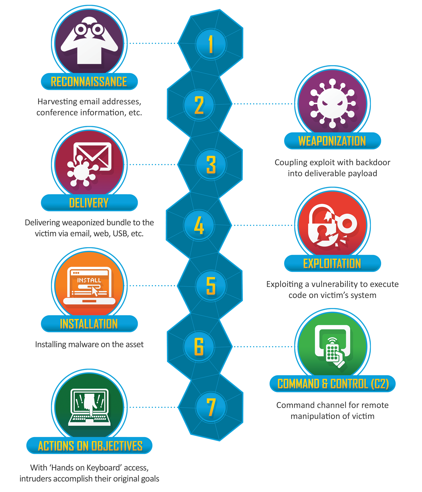

# 🔓 Authentication Bypass

## Practice

### Authentication Bypass using DELETE Method

* Capture a Login request and send it to the burp repeater
* In the repeater window change the request method from GET or POST to DELETE
* If the response returns with 200 OK then you successfully bypassed the login mechanism

<figure><figcaption>
Auth Bypass Output
</figcaption></figure>

***

## FOR FURTHER READING

* [https://book.hacktricks.xyz/pentesting-web/login-bypass](https://book.hacktricks.xyz/pentesting-web/login-bypass)
* [https://exploit-notes.hdks.org/exploit/web/method/web-login-bypass/](https://exploit-notes.hdks.org/exploit/web/method/web-login-bypass/)

