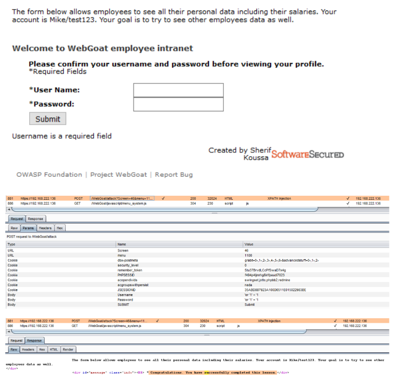

# XPath Injection

## Introduction

XPath is a language that has been designed and developed primarily to address parts of an XML document. XML databases that organize data using the XML language. XPath is very similar to SQL in its purpose and applications, an interesting result is that XPath injection attacks follow the same logic as SQL injection attacks.

## How to Test

* Refer: SQL injection Authentication Bypass

## Test Example

<figure><figcaption>
WebGoat
</figcaption></figure>

## REFERENCES

* [https://book.hacktricks.xyz/pentesting-web/xpath-injection](https://book.hacktricks.xyz/pentesting-web/xpath-injection)
* [https://owasp.org/www-community/attacks/XPATH\_Injection](https://owasp.org/www-community/attacks/XPATH\_Injection)
* [https://portswigger.net/kb/issues/00100600\_xpath-injection](https://portswigger.net/kb/issues/00100600\_xpath-injection)
